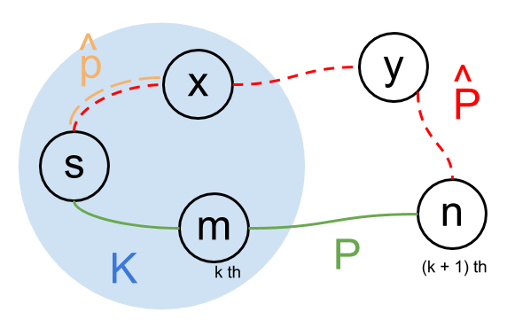

# Dijkstra

In this article, the _Dijkstra_ will be proved by _mathematical induction_.
Suppose we have following variables:

- \\( G \\) is the input graph
- \\( V \\) is the set of all vertices
- \\( K \\) is the set containing all visited vertices
- \\( s \\) is source vertex
- \\( l(x, y) \\) is the length of an edge from  \\( x \\) to  \\( y \\)
- \\( d(x) \\) is shortest path distance found by _Dijkstra_ algorithm.

## Dijkstra algorithm

\\[
\begin{align}
& \text{Dijkstra(\\( G, s \\)):} \newline
& \space \space \space \space \text{for all \\( u \in V \space \backslash \space \\{ s \\} \\):} \newline
& \space \space \space \space \space \space \space \space d(u) = \infty \newline
& \space \space \space \space d(s) = 0 \newline
& \space \space \space \space K = \\{ \\} \newline
& \space \space \space \space \text{while \\( K \neq V \\):} \newline
& \space \space \space \space \space \space \space \space\text{pick \\( u \in V - K \\) with smallest \\( d(u) \\)} \newline
& \space \space \space \space \space \space \space \space K = K \cup \\{ u \\} \newline
& \space \space \space \space \space \space \space \space \text{for all vertices \\( v \\) adjacent to \\( u \\):} \newline
& \space \space \space \space \space \space \space \space \space \space \space \space \text{if \\( d(v) > d(u) + l(u, v) \\) :} \newline
& \space \space \space \space \space \space \space \space \space \space \space \space \space \space \space \space d(v) = d(u) + l(u, v)
\end{align}
\\]

## Proof by mathematical induction

_Proof_:
For each \\( x \in K, \space d(x) \\) is the shortest path from \\( s \\) to  \\( x \\).

1. Basis: when \\( \vert K \vert = 1, \space K = \{ s \} \\), the \\( d(s) = 0 \\),
   the assumption is correct.  
2. Inductive hypothesis:
   - Suppose the condition is hold when \\( \vert K \vert = k > 1 \\).
   - Let \\( m \\) be the latest vertex(the \\( k \\)th vertex)
     added to \\( K, \space K = \{ s, ..., m \} \\).
3. Inductive step:
   - Let \\( n \\) is the next vertex(the \\( (k+1) \\)th vertex)
     that will be added to \\( K \\) (Currently, \\( n \notin K \\)).
   - Let \\( l(m, n) \\) be the chosen edge, where \\( d(n) = d(m) + l(m, n) \\).
     The path from \\( s \\) to  \\( m \\) plus \\( l(m, n) \\) denotes \\( P \\),
     and \\( Length(P) = d(n) \\).
   - Consider another path \\( \hat{P} \\) from \\( s \\) to \\( n \\) via \\( x \\),
     where \\( x \ne m\\).
     We will show \\( Length(\hat{P}) \ge Length(P) \\).
   - Let \\( edge(x, y) \\) is the first edge in \\( \hat{P} \\) that leaves \\( K \\).
     That is, \\( x \in K \\) but \\( y \notin K \\).
     \\( \hat{P} \\) is one path from \\( s \\) to  \\( x \\) to \\( y \\) to \\( n \\).
   - Let \\( \hat{p} \\) be one subpath of \\( \hat{P} \\) from \\( s \\) to \\( x \\), so
     \\( Length(\hat{p}) \ge d(x) \\)
   - \\( Length(\hat{P}) \ge Length(\hat{p}) + l(x, y) \\).
     (\\( Length(\hat{P}) = Length(\hat{p}) + l(x, y) \\) when \\( y = n \\).
     In this case, \\( l(x, n) \\) is not chosen,
     so \\( Length(\hat{P}) = Length(\hat{p}) + l(x, n) \ge d(m) + l(m, n) = Length(P) \\)).
   - From above: \\( Length(\hat{P}) \ge d(x) + l(x, y) \ge d(y) \\)
   - For all vertices \\( i \in V - K \\) including \\( y, n \\),
     the minimal \\( d(i) \\) happens when \\( i = n \\),
     so \\( d(y) \ge d(n) \\). (That's why \\( n \\) is chosen instead of \\( y \\).)
   - Thus, \\( Length(\hat{P}) \ge d(n) = Length(P) \\).

## Simple implementation

### Implementation with priority-queue(heap)

## References

- [Proof for Dijkstra’s Algorithm](http://web.cs.ucdavis.edu/~amenta/w10/dijkstra.pdf)
- [Dijkstra’s algorithm: Correctness by induction](https://web.engr.oregonstate.edu/~glencora/wiki/uploads/dijkstra-proof.pdf)
- [Proof of Dijkstra's Algorithm](https://www.cs.auckland.ac.nz/software/AlgAnim/dij-proof.html)
- [Proof of Dijkstra](https://chunminchang.gitbooks.io/cplusplus-learning-note/content/Appendix/Dijkstra.html)
